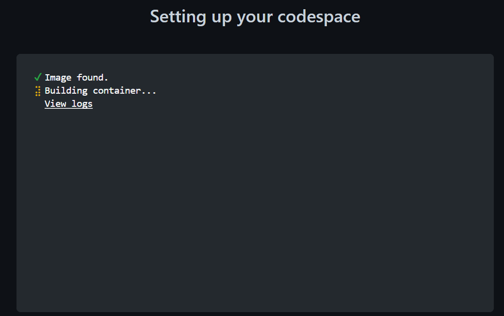

# 1. Create a Codespace

In your fork, go to "Code" then switch to the "Codespaces" tab and click "Create codespace on main"

A new tab will open and codespace creation will begin.

When the codespace is active, you will see a VSCode user interface. All code and tools are preinstalled into this environment. You are now ready to begin.

➡️ Next: [Create a Kubernetes Cluster and Install Software](2-create-cluster.md) ➡️