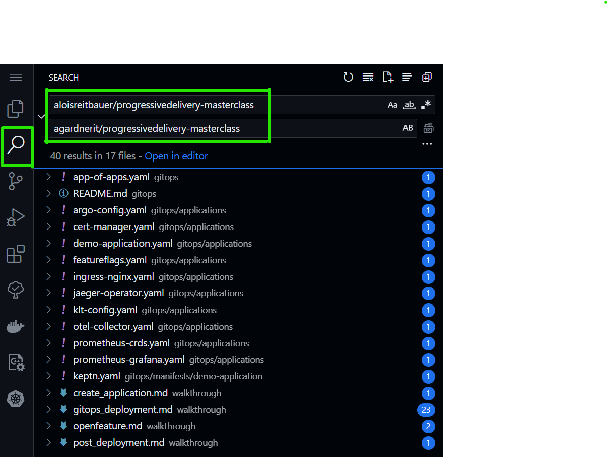
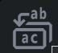
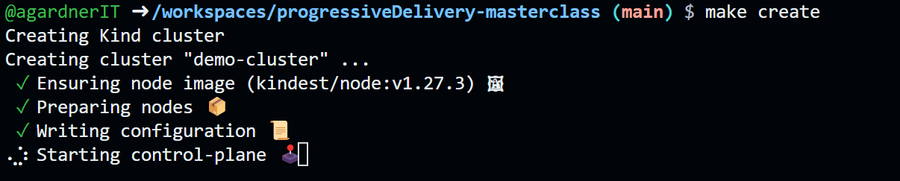

# 2. Create a Kubernetes Cluster and Install Software

Click the magifying glass icon in the left hand menu and perform a find and replace

- Find: `{{ temp_site_url }}`

- Replace with: `YourGitHubUsernameHere/progressivedelivery-masterclass`



Click the replace icon  and you'll see a warning (the number of occurrences and your text will be different)


Commit your changes to your repository:

```shell
git add -A
git commit -m "use my forked repo"
git push
```

In the terminal window, type:

```
make create
```

This command will:

- Create a new kubernetes cluster, exposing all the required ports
- Install ArgoCD
- Patch the ArgoCD ConfigMap so that Argo and Keptn work together to properly inform of Argo application health status
  - Add a NodePort service so we can access the Argo user interface
  - Trigger the installation of an Argo "App of Apps" to install our applications using ArgoCD. This will be explained in detail later.
  - Print the ArgoCD user interface password to the terminal



When the installation process is complete, you should see the Argo password (a random string of characters) and the following message:

```shell
🎉 Installation Complete! 🎉
```

Copy the ArgoCD password and proceed with the next steps.

➡️ Next: [Access ArgoCD](3-access-argo.md) ➡️