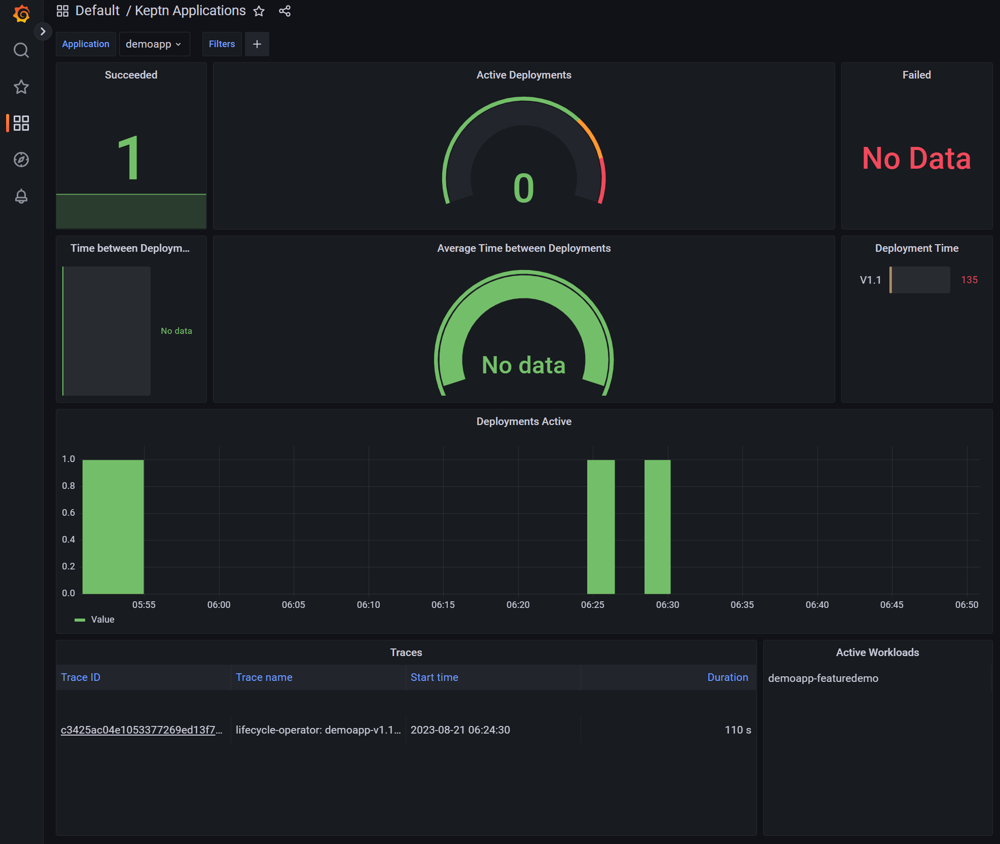

# View Deployment Telemetry

Keptn emits DORA metrics and OpenTelemetry traces for every deployment.

In the codespace, go to the `Ports` tab and open Grafana.

Login with these details:

- Username: `admin`
- Password: `admin`

* Go to "Dashboards > Browse"
* Open the "Keptn Applications" dashboard in the "Default" folder

You should see:

* 1 successful deployment
* Zero failed deployments
* Zero active deployments (this metrics tracks currently-in-progress deployments)
* Zero data for "time between deployments" (this is calculated when there are > 1 deployments)
* A deployment time (in seconds) for `V1.1`
* An OpenTelemetry trace for the `V1.1` deployment

Clicking the OpenTelemetry trace displays the end-to-end timings of the deployment as ArgoCD actioned it.

➡️ Next: [Deploy a Slow Version of the Application](6-deploy-slow-version.md) ➡️