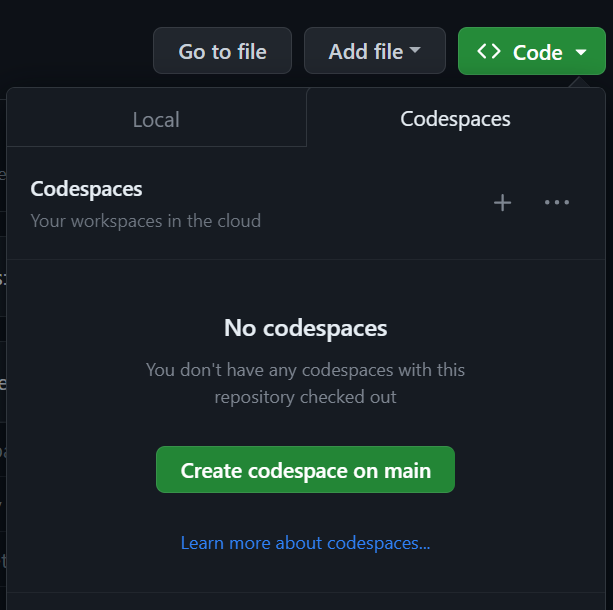
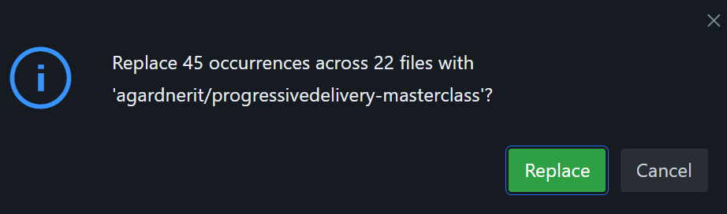
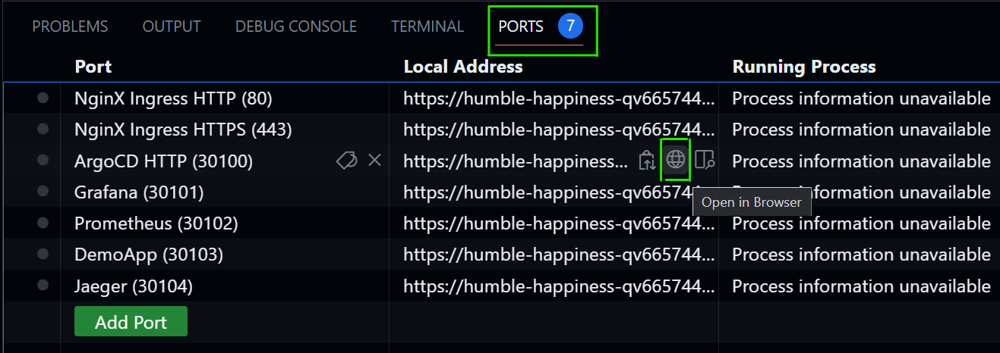
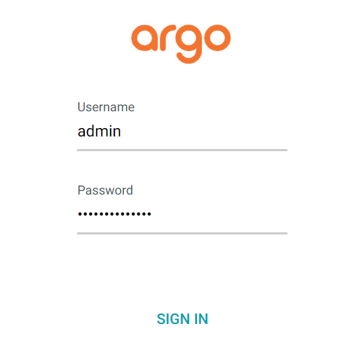
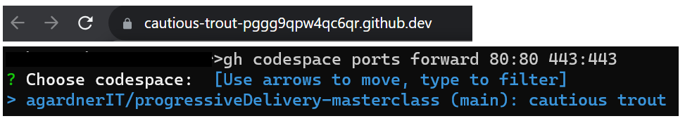
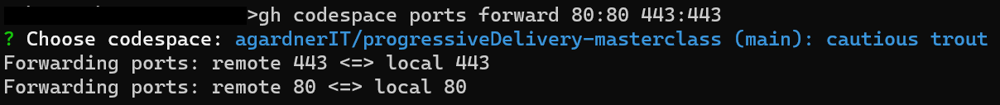
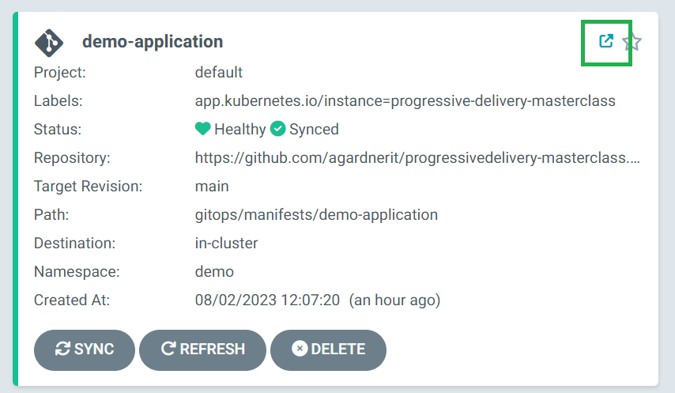
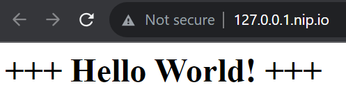

# Walkthrough of the Masterclass

## Introduction

This masterclass guides illustrates how to use
Keptn and OpenFeature
to gain better observability and management
of your cloud-native software deployment.

> :warning:
> This has currently only been tested in cloud-based codespaces.
> Please do not try to run this locally in VSCode.
> This notice will be removed when this functionality is reliable.

> :question:
> What is a codespace?
> A codespace is a self-contained, temporary and disposable cloud-hosted environment.
> We will use it so you don't need to clutter up your system.

## Preparation

1. [Install the gh CLI tool](https://github.com/cli/cli#installation) on your local machine. This is the only tool you will need locally.
1. Fork this repository to your GitHub Account
2. In your fork, go to "Code" then switch to the "Codespaces" tab and click "Create codespace on main"



3. A new tab will open and codespace creation will begin.


4. When the codespace is active, you will see a VSCode user interface. All code and tools are preinstalled into this environment. You are now ready to begin.

## Create Cluster and Install Applications

1. Click the magifying glass icon in the left hand menu and perform a find and replace
  - Find: `aloisreitbauer/progressivedelivery-masterclass`
  - Replace: `YourGitHubUsername/progressivedelivery-masterclass`


2. Click the replace icon  and you'll see a warning (of course, your text will be different)



3. Commit your changes to your repository:

```shell
git add -A
git commit -m "use my forked repo"
git push
```

3. In the terminal window, type: `make create`. This command will:
  - Create a new kubernetes cluster, exposing all the required ports
  - Install ArgoCD
  - Patch the ArgoCD ConfigMap so that Argo and Keptn work together to properly inform of Argo application health status
  - Add a NodePort service so we can access the Argo user interface
  - Trigger the installation of an Argo "App of Apps" to install our applications using ArgoCD. This will be explained in detail later.
  - Print the ArgoCD user interface password to the terminal


When the installation process is complete, you should see the Argo password (a random string of characters) and the following message:

```shell
🎉 Installation Complete! 🎉
```

Copy the ArgoCD password and proceed with the next steps.

## Access Argo

1. Switch to the "Ports" tab in the terminal window. Hover over the entry for ArgoCD and click the "globe" icon
1. A new tab will open and the ArgoCD login screen will be displayed
1. Log into ArgoCD. Username is `admin` and hte password is the random string you copied before.
   If you forget the Argo password, it can be retrieved with `kubectl -n argocd get secret argocd-initial-admin-secret -o jsonpath="{.data.password}" | base64 -d`




## Wait for Installation

The platform stack is being installed and progress can be tracked via the `progressive-delivery-masterclass` application. This applications is an "app of apps" meaning it is an application which installs other applications in turn. The platform stack will not be ready until `progressive-delivery-masterclass` is green.


There are many applications which make up the platform. The installation will take a few moments so let's use the time to understand what's happening.

The platform is built from the following applications:

- ArgoCD
- Cert Manager
- Keptn Lifecycle Toolkit
- Grafana
- Prometheus
- Jaeger Operator (installs Jaeger)
- OpenFeature Operator (installs flagd)
- OpenTelemetry Collector

These applications are all being deployed at different times, as "bundles" or "waves", as Argo calls them.

The waves are processed in order, lowest first.

### Wave -1
- Argo configuration

### Wave 0
- Cert Manager
- Ingress NGINX

### Wave 2
- Keptn Lifecycle Toolkit
- OpenFeature Operator

### Wave 3
- Jaeger Operator
- OpenTelemetry Collector
- Prometheus
- Grafana

### Wave 4
- Feature flags configuration

### Wave 10
- Demo Application

## Wait for green

Wait until the `progressive-delivery-masterclass` application is green. This means that the stack is ready.


## Use nice URLs

Although port-forwarding is easy (it gave us access to Argo), it is more user-friendly to use "easy" URLs.

The applications on the cluster are already configured for these URLs but we need a way into the cluster to access them.

To do this, open a terminal window (or `cmd`) and run the following command on your **local machine**:

```shell
gh codespace ports forward 80:80 443:443
```

It will prompt you to pick the correct codespace. The two word, randomly generated name should match what is shown in your browser window.



Hit the `Enter` key and you should see a message like this:

```shell
Forwarding ports: remote 443 <=> local 443
Forwarding ports: remote 80 <=> local 80
```



## Use Ingresses

The "friendly URLs" are now enabled. Wherever you see the "open in new window" icon in Argo , clicking it will take you to that service.



Try it now on the demo app and you should see:



### Application Shortcuts

Here are some quick shortcuts to the important UIs:
- Demo application: `http://127.0.0.1.nip.io`
- Grafana: `http://grafana.127.0.0.1.nip.io` (username: `admin`, password: `admin`)
- Jaeger: `http://jaeger.127.0.0.1.nip.io`
- Prometheus: `http://prometheus.127.0.0.1.nip.io`
